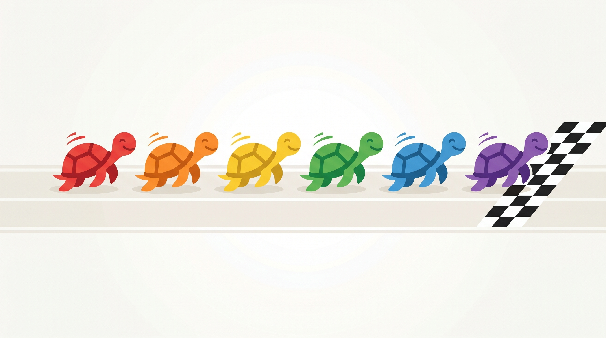

<div align="center">



# Race Turtle

A friendly turtle racing game. Pick a colour, place your bet, and watch six
turtles dash for the finish line.

[](https://github.com/R-Htu/race-turtle/actions/workflows/ci.yml)
[](https://www.python.org/)
[](https://github.com/astral-sh/ruff)
[](https://mypy-lang.org/)
[](LICENSE)

</div>

---

## About

`race-turtle` started life as a single-file beginner project — a small game made
for a kid using Python's built-in [`turtle`](https://docs.python.org/3/library/turtle.html)
graphics. It has been refactored into a clean, tested, fully-packaged project
**without losing the original fun**: the gameplay is identical, the code is just
honest, readable, and reliable now.

The key design decision is a strict separation between the **pure simulation**
(`race_turtle.engine`) and the **`turtle` rendering layer** (`race_turtle.game`).
The engine has no display dependency, so the game logic is fully unit-tested and
reproducible with a seed, while the GUI simply mirrors the engine's state onto
the screen.

## How to play

Six turtles line up on the left. Each player names the colour they think will
win. The turtles advance by random amounts until one crosses the finish line on
the right. If your colour wins, you win.

## Install

Requires **Python 3.9+**. The game uses only the standard library — `turtle`
ships with CPython (on Linux you may need the system `python3-tk` package for the
GUI).

```bash
git clone https://github.com/R-Htu/race-turtle.git
cd race-turtle
pip install .
```

For development (tests, linters, type-checker):

```bash
pip install -e ".[dev]"
```

## Usage

Launch the graphical game:

```bash
race-turtle
# or, equivalently:
python -m race_turtle
```

Run a race in the terminal — no display needed (great for trying it on a server
or reproducing a result):

```bash
python -m race_turtle --headless --seed 42 --bet "My son=red" --bet "Me=blue"
```

```text
Finished in 78 ticks.
Standings:
  1. blue      401.0
  2. green     394.0
  3. red       393.0
  4. purple    380.0
  5. orange    350.0
  6. yellow    350.0
Winner: blue
Correct bets: Me
```

### Command-line options

| Option | Description |
| --- | --- |
| `--headless` | Run the simulation and print the result; no GUI/display required. |
| `--seed N` | Seed the RNG for a reproducible race. |
| `--colors C [C ...]` | Use a custom set of racer colours (at least two, all unique). |
| `--bet "PLAYER=COLOR"` | Add a bet in headless mode (repeatable). |
| `--track-length N` | Distance a racer must cover to win (default `400`). |
| `--max-step N` | Maximum advance per tick (default `10`). |
| `--version` | Print the version and exit. |

## Project structure

```text
race-turtle/
├── src/race_turtle/
│   ├── __init__.py      # public API + version
│   ├── config.py        # constants and layout helpers (no more magic numbers)
│   ├── models.py        # Racer, RaceResult data classes
│   ├── bets.py          # bet parsing, normalisation, resolution
│   ├── engine.py        # pure, seedable, headless race simulation
│   ├── game.py          # turtle rendering + input (the only GUI module)
│   ├── cli.py           # argparse entry point
│   └── __main__.py      # `python -m race_turtle`
├── tests/               # pytest suite (engine, bets, config)
├── .github/workflows/   # CI: ruff + mypy + pytest on 3.9–3.12
├── pyproject.toml        # packaging + tool config
├── CHANGELOG.md
└── LICENSE
```

## Development

```bash
pip install -e ".[dev]"

pytest                 # run the test suite
pytest --cov=race_turtle --cov-report=term-missing  # with coverage
ruff check .           # lint
ruff format .          # format
mypy                   # strict type-check

pre-commit install     # enable git hooks (optional)
```

Continuous integration runs the linter, the strict type-checker, and the full
test suite across Python 3.9, 3.10, 3.11 and 3.12 on every push and pull
request.

## What changed from the original

- Colour bets are matched **case-insensitively** and whitespace-trimmed, fixing
  a bug where a correct guess like `Red` was scored as a loss.
- Winner detection now uses a single authoritative finish check instead of
  running inside the per-turtle movement loop, removing duplicate / incorrect
  result messages.
- Invalid or cancelled bet input is validated and re-prompted.
- The game logic is decoupled from rendering, making it testable and seedable.
- A committed `venv/` and `.idea/` were removed and are now git-ignored.

See the full [CHANGELOG](CHANGELOG.md) for details.

## License

Released under the [MIT License](LICENSE).
